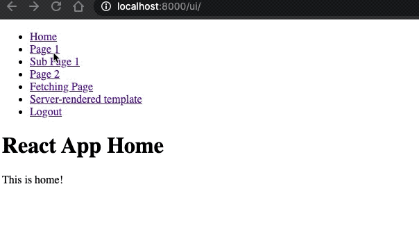

### Demo

### End goal

- React running inside [Django](https://www.djangoproject.com/), with [create-react-app](https://create-react-app.dev/) (CRA).
    - Frontend and backend served from the same domain.
    - Run frontend on port 3000 with hot-reloading and all CRA features working nicely.
    - Run full app on port 8000 after running `yarn build`.
- [Django routing](https://docs.djangoproject.com/en/3.1/topics/http/urls/) and [React Router](https://reactrouter.com/web/) 
playing nicely together.
    - Redirects work.
    - Subroutes work.
- Login page created using Django.
- APIs using [SessionAuthentication](https://www.django-rest-framework.org/api-guide/authentication/#sessionauthentication).
- Project is [Docker](https://www.docker.com/) -ised.
